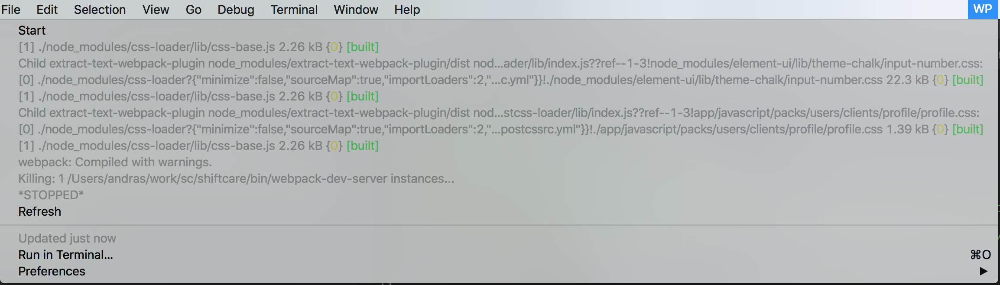

## Runner

Execute script and tails its output<br>



The file needs to be amended accordingly. This particular runner runs `${HOME}/work/sc/shiftcare/bin/webpack-dev-server`, see config below

```
BITBAR_LABEL="WP"

SCRIPT_SHORTNAME="Webpack"
SCRIPT_FULL_PATH="${HOME}/work/sc/shiftcare/bin/webpack-dev-server"
```